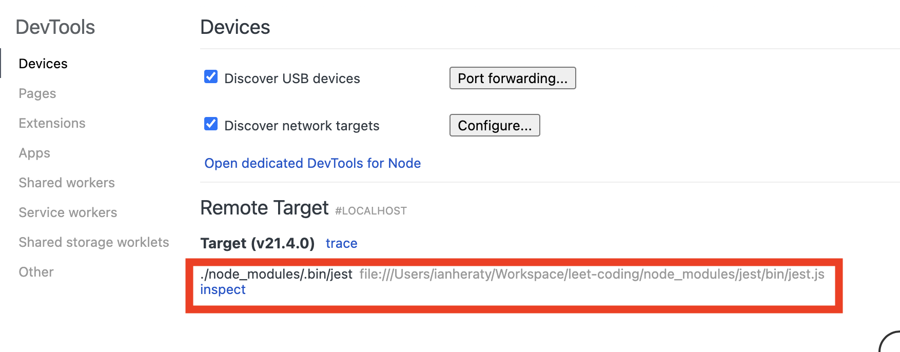
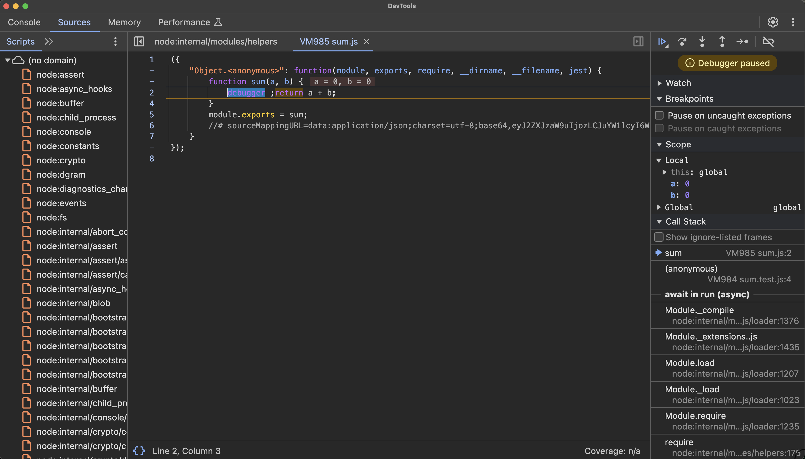
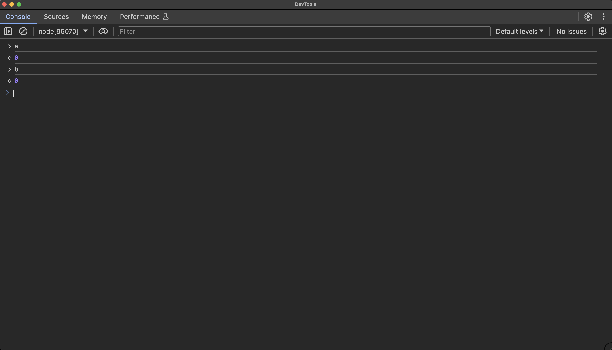

# Data Structures and Algorithms Workspace
This is a workspace for practicing leet code type problems. It's a good idea to code out these types of problems in your own workspace and write your own unit tests as you work through the problems.

## Ruby
Enter `bundle install` in the terminal to install dependencies. 

You can run the tests by file eg `ruby tests/test_sum.rb` and `minitest/autorun` will run all the tests in the file. You can also run all ruby tests with `ruby tests/*.rb`. It will output the results of your tests.

```bash
Run options: --seed 41419

# Running:

..

Finished in 0.000399s, 5012.5312 runs/s, 5012.5312 assertions/s.
2 runs, 2 assertions, 0 failures, 0 errors, 0 skips
```

### Debugging
You can use the [debug](https://github.com/ruby/debug) gem to create breakpoints.

```ruby
require 'debug' # import debug gem

def sum(a, b)
  debugger # create a breakpoint
  return a + b
end
```

## Javascript
Enter `npm install` in the terminal to install dependencies. You may want to install [Jest](https://jestjs.io/) globally to run it directly in the terminal. (`npm i jest --global`)

You can run the tests by file eg `jest tests/sum.test.js` and [Jest](https://jestjs.io/) will run all the tests in the file. You can also run all js tests with `npm test`. This triggers the "test" script in `package.json`. It will run the jest tests and output the results.

### Debugging
You can use the `debugger` keyword in your javascript code to create breakpoints. Node includes a [command line debugging utility](https://nodejs.org/api/debugger.html). You can simply add `inspect` when calling your javascript scripts. eg `node inspect sum.js`. Since we're using Jest, we need to call the jest package from our `node_modules/`. Also, we can use the chrome debugger for more advanced debugging. We have this script `"testDebug": "node --inspect-brk ./node_modules/.bin/jest --runInBand"`. We can run this script by entering `npm run testDebug` in the terminal. 

```bash
ianheraty@UDPICL1IHERA2 leet-coding % npm run testDebug

> leet-coding@1.0.0 testDebug
> node --inspect-brk ./node_modules/.bin/jest --runInBand

Debugger listening on ws://127.0.0.1:9229/c0d888ae-7590-44ef-b880-068a11915e2f
For help, see: https://nodejs.org/en/docs/inspector
```

Then, open chrome and enter `chrome://inspect` in the address bar. 



Click the `inspect` link to start the debugging session.



You can also use the console to log the values of your variables.


